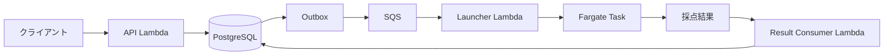

# ジャッジの実行モデル

## 対象範囲

この実行モデルは、C、C++、Rust、Java、Pythonで提出されたプログラムを対象とする。

各提出は一つのFargateタスクで処理する。
同じタスクを別の提出へ再利用しない。

## 処理の流れ

提出を受け付けたAPIは、採点が終わるまで接続を維持しない。
採点要求を永続化した後、非同期にFargateタスクを起動する。

Fargateタスクでは、Goで実装した`judge-runner`が次の処理を行う。

1. ソースコード、テストセット、採点条件を取得する。
2. ソースコードを一度だけコンパイルする。
3. コンパイル済み成果物をタスク内へ保持する。
4. テストケースごとに新しい子プロセスを起動する。
5. 実行時間、メモリ使用量、終了状態、出力を検査する。
6. 期待される出力と実際の出力を比較する。
7. 全テストケースの結果を集約して保存する。
8. Fargateタスクを終了する。

テストケースごとにプロセスを作り直すため、前のケースで変更したグローバル変数や作業ファイルは次のケースの実行状態へ持ち越さない。
コンパイル済み成果物だけは同じ提出の全テストケースで共有する。

## リソース境界

Fargateタスクには1 vCPUと2 GiBを割り当てる。
ユーザープログラムとその子孫プロセスが利用できるメモリは、合計512 MiBまでとする。

Fargateのタスクメモリは、ユーザープログラムのMLEを直接判定する値ではない。
`judge-runner`が512 MiBの上限を検出して対象のプロセス群を停止した場合に限り、MLEとして扱う。

タスク全体がメモリ不足で停止した場合はJudge Errorとして扱う。
`judge-runner`は停止したフェーズがコンパイル中かテスト実行中かを記録し、ユーザープログラムの制限超過とジャッジ基盤の障害を区別する。

## コンパイルと実行

コンパイル処理とテスト実行には別の制限を適用する。
問題が指定する512 MiBの上限は、コンパイラには適用しない。

コンパイルに失敗した場合はCompile Errorとして採点を終了し、テストケースを実行しない。
コンパイルが成功した場合は同じ成果物を使い、テストケースごとに独立した子プロセスを起動する。

ユーザープロセスが制限を超えた場合は、子孫を含むプロセス群を停止する。
一部の子プロセスだけが残る状態を許すと、後続のテストケースと`judge-runner`へ影響するためである。

## `txt`提出

`txt`は初期対応する提出形式に含まれるが、プログラムとしてコンパイルまたは実行するかは決定していない。

提出内容をそのまま出力として比較する方式を採用する場合、Fargateタスクを起動せずに判定できる。
`txt`の入力形式、複数テストケースの扱い、出力比較方法を決めた時点で、ランタイム方針へ追加する。

## 関連する決定

- [ADR 0001](../adr/0001-use-aws-fargate-for-judge-execution.md)
- [ADR 0002](../adr/0002-standardize-judge-task-resources.md)
- [ADR 0003](../adr/0003-store-test-sets-in-amazon-s3.md)
