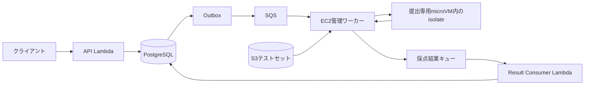

# ジャッジの実行モデル

## 対象範囲

この文書は、C、C++、Rust、Java、Pythonを対象とする本番向けの設計を記録する。
現在の[ローカル開発用Dockerワーカー](local-cpp.md)とは異なり、Firecrackerとisolateによる実装は未完了である。

EC2上で一提出につき一つのFirecracker microVMを作成し、ゲスト内のisolateでコンパイルとケース実行を制御する。
使用済みのVMを別の提出へ再利用しない。

## 処理の流れ

提出を受け付けたAPIは採点要求を永続化し、採点完了を待たずに応答する。
OutboxからSQSへ渡された要求をEC2上の管理ワーカーが受信する。

1. 管理ワーカーが提出、問題リビジョン、テストセット、ランタイム、制限値を確定する。
2. 固定したゲストイメージから提出専用VMを起動し、ソースコードを渡す。
3. ゲストの`judge-runner`がコンパイル専用のisolate環境で一度だけコンパイルする。
4. 管理ワーカーが必要なバンドルをS3から順次取得し、Version ID、サイズ、チェックサムを照合して展開する。
5. ケースごとに新しいisolate環境とcgroupを作り、成果物を読み取り専用で配置して入力を渡す。
6. `judge-runner`が制限下で実行し、計測値、終了状態、上限付きの出力を管理ワーカーへ返す。
7. 管理ワーカーが期待出力と比較し、ケース結果と提出全体の結果を集約する。
8. VMと提出専用の書き込み領域を廃棄し、結果を永続化できる結果キューへ送る。
9. 結果の送信成功後に採点要求を確認応答し、Result ConsumerがDBへ結果を反映する。

結果には提出IDと試行IDを含め、重複配信や古い試行が確定済みの結果を上書きしないようにする。
キューの可視性期限、延長、再試行回数、ワーカー停止時の回収手順は実装時に定める。

## 隔離とデータの配置

Firecrackerはjailer経由で起動し、提出ごとにゲストカーネルと書き込み領域を分離する。
ゲストにネットワークインターフェースを付けず、AWS認証情報、署名付きURL、期待出力を置かない。
管理ワーカーだけがAWSへ通信し、入力と結果を用途の限定されたチャネルで転送する。
転送の具体方式は未決定とし、受信側でサイズ、形式、提出とケースの対応を検証する。

isolateでは非特権の提出プロセスと、採点制御プロセスを分離する。
提出プロセスから管理チャネル、計測メタデータ、他ケースの入力、他提出の領域へアクセスできないようにする。
ゲストからの出力や成果物をホスト上で実行しない。

コンパイル済み成果物だけを同じ提出のケース間で共有する。
各ケースの作業領域とcgroupは作り直し、残存プロセスや以前のcgroupのメモリ課金を引き継がない。
共通の読み取り専用ランタイムやゲストOSのキャッシュまで完全に初期化する構成ではないため、ケース順序による計測差は実機で確認する。

## 制限と計測

cgroup v2に対応するisolateとゲストカーネルを組み合わせ、必要なコントローラーを利用できる状態で起動する。
ホストとゲストのswapは無効にする。

| 項目 | 定義と適用方法 |
| --- | --- |
| CPU時間 | 提出プロセスと子孫のユーザー時間とシステム時間の合計。isolateのcgroupモードで取得し、採点上の時間制限を適用する |
| 経過時間 | ケース実行の開始から終了までの実時間。CPU時間とは別に上限を設け、sleepや入出力待ちを回収する |
| 最大メモリ使用量 | ケース専用cgroupの`memory.peak`に基づくピーク値。子孫とcgroupに課金されるキャッシュなどを含み、RSSとは区別する |
| メモリ上限 | 本番の共通方針は512 MiB。ケース用cgroup全体へ適用する |
| その他の制限 | 出力量、プロセス数、ファイル記述子数、一時領域、ファイルサイズを制限する |

isolateの時間とメモリの単位を確認して、保存値をCPU時間と経過時間はミリ秒、最大メモリはバイトへ統一する。
ケースごとに計測値、適用した上限、終了コード、終了シグナル、制限超過の根拠を記録する。
取得できなかった値は0へ置き換えず、欠測として扱う。
必要な計測値が取れなければ採点を成功扱いにしない。

VM起動、コンパイル、S3取得、出力比較はケースのCPU時間に含めない。
コンパイルには独立した時間とメモリ上限を設定する。
VM全体のメモリにはゲストOSと採点制御の余白を設け、EC2とVMのサイズは実測後に固定する。
最初は同時採点数1で基準を取り、並列化時の計測差とCPU競合を検証する。

## 判定と障害回収

| 状態 | 判定 |
| --- | --- |
| コンパイルの失敗、コンパイル用制限の超過 | Compile Error |
| ケースのCPU時間または経過時間上限による停止 | Time Limit Exceeded |
| ケース用cgroupのOOMなど、メモリ制限による停止を確認 | Memory Limit Exceeded |
| ケースの出力上限超過 | Output Limit Exceeded |
| 制限超過で説明できない異常終了 | Runtime Error |
| 正常終了し、期待出力と不一致 | Wrong Answer |
| 正常終了し、期待出力と一致 | Accepted |
| VM全体やホストのOOM、起動失敗、計測不能、制御系の障害 | Judge Error |

終了コード137やSIGKILLだけでMLEと断定せず、ケース用cgroupと監視側の記録を照合する。
割り当て失敗だけでOOMの証拠がない場合も、自動的にMLEへ読み替えない。
複数の制限が同時に成立した場合の優先順位は実装時に固定し、根拠を保存する。

正常終了時も制限超過時も、子孫を含むケースのプロセス群を回収する。
回収を確認できなければ次のケースへ進まず、VMを廃棄してJudge Errorとする。
管理ワーカーはゲストの監視とは独立した期限を持ち、応答しないVMを終了する。
ワーカー再起動時にも、所有する試行が失効したVMと一時領域を回収する。

## 本番投入前の検証

- 無限ループとsleepを、それぞれCPU時間と経過時間の上限で停止できること。
- 子孫プロセスを含むメモリ超過、プロセス増殖、大量出力を制限できること。
- ケース終了後にプロセスと作業ファイルが残らないこと。
- ネットワーク、認証情報、期待出力、管理チャネルへ提出コードがアクセスできないこと。
- VMの異常終了、ホストの資源不足、ワーカー停止、結果の重複配信を処理できること。
- コンパイラと各言語ランタイムが制限下で動作し、反復実行と並列実行の計測差が許容範囲に収まること。

## `txt`提出

`txt`の判定方式は未決定である。
提出内容を出力として直接比較する方式なら、microVMを起動せずに判定できる。
入力形式と複数ケースの扱いを決めた時点でランタイム方針へ追加する。

## 関連する決定

- [ADR 0005](../adr/0005-use-firecracker-and-isolate-on-ec2.md)
- [ADR 0003](../adr/0003-store-test-sets-in-amazon-s3.md)（採点時の取得主体はADR 0005で変更）
- [ADR 0004](../adr/0004-use-postgresql-as-primary-database.md)
