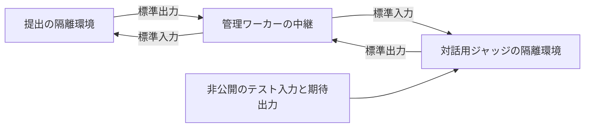

# インタラクティブ問題の仕様案

[ADR 0009](../adr/0009-support-interactive-judge.md)に対応する未実装の仕様案である。
提出と同じ言語群を使う方針は合意済みで、以下の上限値と動作は検討案とする。
現在稼働中の問題形式や実行上限は変更していない。

## 作問と保存

問題編集画面の判定方法で「対話形式」を選び、対話用ジャッジの言語とコードを登録する。
下書きには`interactor: {"runtime": "python314", "source": "..."}`を保存する。
既存の`checker`と`interactor`は同時に指定できない。
どちらもなければ通常判定とし、生成用と入力検証用のジョブには対話形式を指定しない。

言語は`GET /runtimes`の公開一覧から選ぶ。
下書きでは空コードを保存できるが、公開と提出には空でないコードと公開中の言語を必要とする。
公開操作と提出受付では、対話用ジャッジとテストケースを一緒に固定する。
公開済みの問題への提出には公開版を使い、未公開なら作問者の下書きを使う。
問題画面にも対話形式であることを表示する。

## プログラムの接続

対話用ジャッジには、スペシャルジャッジと同じ順序で次の4つのファイルパスを渡す。

1. テスト入力。
2. 期待出力。未使用なら空ファイル。
3. 提出されたソースコード。
4. 書き込み可能なスコアファイル。内容は集計しない。

提出側の標準入力には、対話用ジャッジが書いた内容だけを流す。
テスト入力を自動的に送らないため、作問者が必要な初期情報を出力する。
各ケースで両側のプログラムを起動し直し、作業領域と子孫プロセスを破棄する。

中継はバイト列を維持し、改行や空白を加工しない。
両側のプログラムは相手の応答を待つ前に標準出力をflushする。
Pythonでは`print(..., flush=True)`、C++では`std::flush`などを使う。
標準エラーを対話へ混ぜず、問いの形式と質問回数の上限は問題文と対話用ジャッジで定義する。
専用のQLEやスコア集計は追加しない。

## 資源上限の初期案

| 対象 | 上限案 |
| --- | --- |
| 同時採点 | 1提出。1ケース内で提出と対話用ジャッジを同時実行 |
| 各コンパイル | CPU 30秒、経過40秒、1 GiB。順番に実行 |
| 提出の実行メモリ | 512 MiB |
| 対話用ジャッジの実行メモリ | 256 MiB |
| 提出のCPU時間 | 問題設定の100〜5,000 ms |
| 対話用ジャッジのCPU時間 | ケースごとに5秒 |
| 対話全体の経過時間 | `3 × (提出のCPU上限秒 + 5) + 1`秒 |
| 採点全体の経過時間 | コンパイルと全ケースを含め1,800秒 |
| 各方向の標準出力 | ケースごとに16 MiB |
| 各プログラムの標準エラー | ケースごとに64 KiB |
| 中継バッファ | 方向ごとに64 KiB。満杯なら読み取りを止める |
| 保存する対話診断 | 対話履歴と対話用ジャッジの標準エラーを合わせ、提出全体で16 KiB |
| ソース | 各64 KiB、NUL不可 |

メモリはcgroupの使用量として制限し、言語ランタイムと子孫プロセスを含む。
提出結果のCPU時間と最大メモリは提出側の値とし、対話用ジャッジの値を加算しない。
経過時間には相手の応答待ちが含まれる。
既存の1 CPU相当のサービス上限を共有するため、両側のCPU上限を合計して経過時間の予算を取る。
個別の応答待ちタイマーは初期案に含めず、相互待機も対話全体の経過時間で打ち切る。

ワーカー全体の1,536 MiB、swapなし、作業用tmpfs全体512 MiBは維持する案とする。
提出512 MiBと対話用ジャッジ256 MiBの合計は768 MiBであり、残り768 MiBを管理処理などに使える配分になる。
ただし、これは上限の差分であって、常時確保された空き容量ではない。
tmpfs、ファイルキャッシュ、カーネルの管理領域もcgroupに計上されるため、実機では親と子の使用量を併せて確認する。
tmpfsの使用量のうち子のcgroupに計上された分を、子の上限に重ねて加算しない。
メモリの計上範囲は[Linux cgroup v2の資料](https://www.kernel.org/doc/html/latest/admin-guide/cgroup-v2.html#memory)に従う。

プロセス数も同時実行分を配分する。
既存のサービス上限128タスクに対して、各64の設定を2組そのまま使うと管理プロセスの余地がない。
対話形式の実行時は各32タスクを初期案とし、コンパイル時の64を維持する。
言語ごとの起動と採用ライブラリを含め、この配分も公開前に検証する。

## 終了と判定

一方が出力を閉じたら、その方向の中継バッファを送り終えてから相手へEOFを伝える。
管理側に不要なパイプの端点を残してEOFを妨げない。
対話用ジャッジが0で終了しても、その時点ではACに確定せず、提出の正常終了を待つ。
余分な出力や入力不足の検証は作問者が実装する。

失敗が確定したら、相手とその子孫を停止して回収する。
管理側による停止を原因とするシグナルやパイプの切断で、確定した判定を上書きしない。
同時に観測された独立した失敗は、次の順で扱う。

1. 実行基盤の障害、対話用ジャッジのコンパイル失敗、対話用ジャッジ自身のCPU、メモリ、出力上限超過はJE。
2. 提出側のコンパイル失敗、CPU、メモリ、出力上限超過、異常終了はそれぞれCE、TLE、MLE、OLE、RE。
3. 対話用ジャッジの非ゼロ終了とシグナル終了はWA。`assert`の失敗とコード自身のバグを区別しない。
4. 両側が正常終了し、制限超過がなければAC。

両側の正常終了がそろわず対話全体の経過時間を超えた場合はTLEとし、相互待機や片側の終了後の待機を含む時間切れだったことを作問者の診断に残す。
このTLEは、提出側と対話用ジャッジのどちらが待機の原因かを断定するものではない。
採点全体の1,800秒超過は既存仕様と同様にJEとする。

## 診断と公開前の検証

対話診断には方向を付けた発言と対話用ジャッジの標準エラーを記録する。
生のバイト列を採点に使い、表示時だけUTF-8の不正な並びを置換する。
方向表示や置換後の文字列を含めて保存量を制限し、上限到達後も出力量の監視と中継は続ける。
取得できるのは問題作成者自身の提出詳細だけとし、提出一覧と第三者には返さない。

実装時は公開中の全言語を対話用ジャッジとして実機で検証し、提出側との異なる言語の組み合わせも確認する。
256 MiBでの起動と採用ライブラリ、両側のメモリ負荷、tmpfsの使用、子のOOM後のワーカー生存を確認するまで受付を有効化しない。
flush忘れ、相互待機、片側の早期終了、余分な出力、大量出力、残った子孫プロセス、診断の非公開も検証対象とする。
Javaを将来公開する場合は、現在の提出用JVMのヒープ上限256 MiBをそのまま対話用に流用できるとは見なさず、VM全体の消費量を含めて再検討する。

2026年9月13日に稼働中のLightsailを読み取り専用で確認した時点では、OSが認識する総メモリは1,951,772 KiB、サービス上限は1,536 MiBだった。
ワーカーの匿名メモリは約64 MiB、サービスに計上されたファイルキャッシュは約837 MiBで、サービスのOOM記録は0件だった。
これは通常運転中の観測であり、対話形式の負荷試験結果ではない。
確認にはSSMコマンド`657c8d2d-d5e5-4537-a2a9-c125b0452789`と`b7b5724e-2a85-45f0-a043-4db99e71f42a`を使った。
